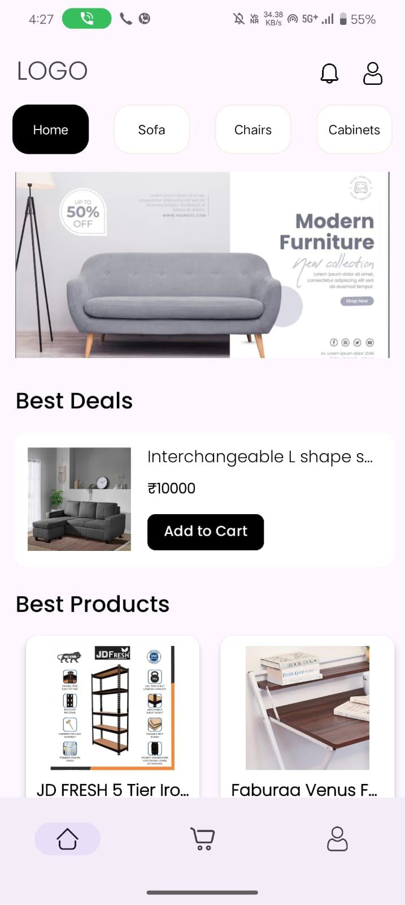
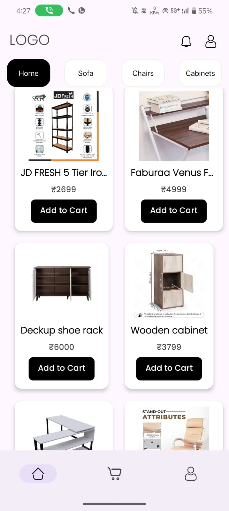
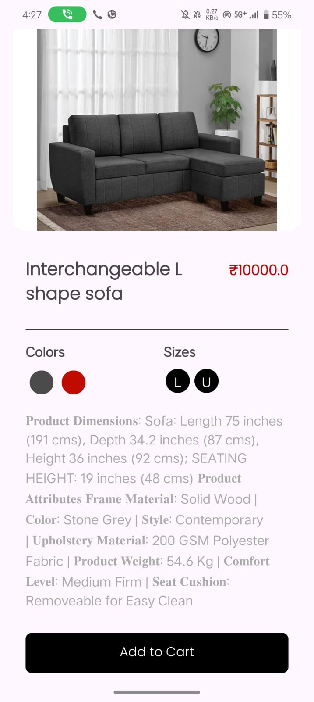
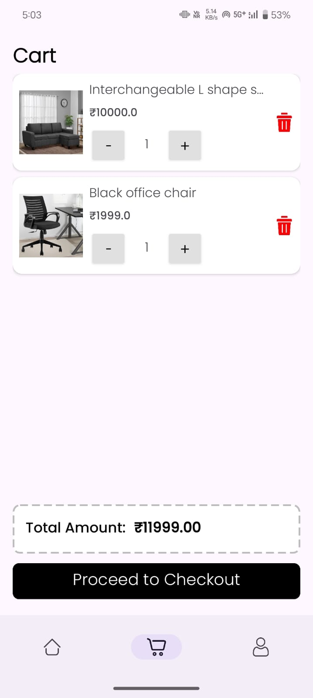
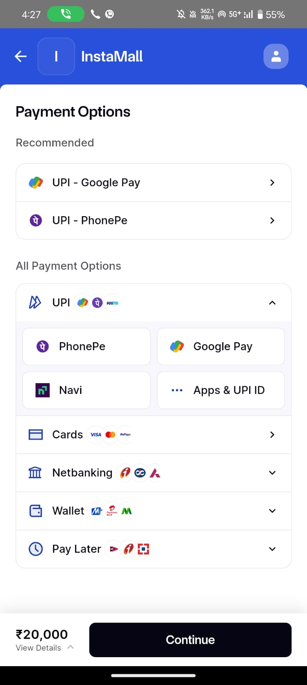
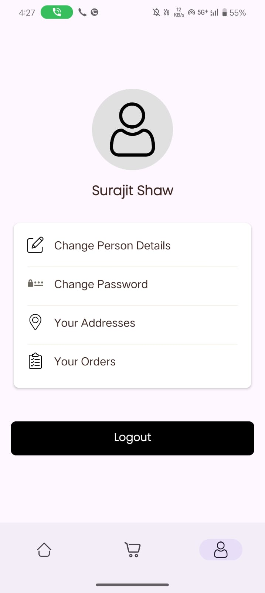

# 🌟 E-Commerce App Project 🌟  

I recently completed an **e-commerce app** using cutting-edge technology to deliver a seamless shopping experience. Here's a glimpse of the tech stack and features that make this project special:  

## 🛠️ Tech Stack & Features  
- **Navigation Component**: Designed a single-activity app with multiple fragments for smoother navigation and better scalability. 🚀  
- **Firebase**: Leveraged Firestore for real-time data and Firebase Authentication for secure login/signup. 🔐 
- **Cloudinary**: Used to upload and manage product images efficiently. 📷  
- **Hilt**: Simplified dependency injection to keep the code clean and modular. 🧹  
- **MVVM & LiveData**: Adopted this architecture to separate business logic from views and handle state management during configuration changes. 🔄  
- **Coroutines**: For executing background tasks like data fetching and payment processing without blocking the UI. ⚙️  
- **View Binding**: Enhanced code safety and reduced boilerplate by binding views automatically. 📋  
- **Glide**: Integrated for caching and loading images smoothly into ImageView. 🌄  
- **Razorpay**: Added secure and reliable payment gateway integration for hassle-free transactions. 💳  

This project was a fantastic learning experience, blending creativity with robust development practices. Stay tuned for more exciting projects! 😊  

---

## 📱 Screenshots  

### **Get Started and Login Screens**  
| **Get Started Screen** | **Login Screen** |  
|-------------------------|------------------|  
|  |  |  

### **Home, Products, and Product Details Screens**  
| **Home Screen**         | **Products Screen**       | **Product Details Screen**       |  
|--------------------------|--------------------------|----------------------------------|  
|  |  |  |  

### **Cart, Payment, and Profile Screens**  
| **Cart Screen**          | **Payment Screen**       | **Profile Screen**              |  
|--------------------------|--------------------------|----------------------------------|  
|  |  |  |  
